# FlashNotePassword
Complete Android Note, Password generator and Flashlight App with clean architecture, MVVM, Room Database, Navigation Components, Safe Args, and Search View.

## Main screen

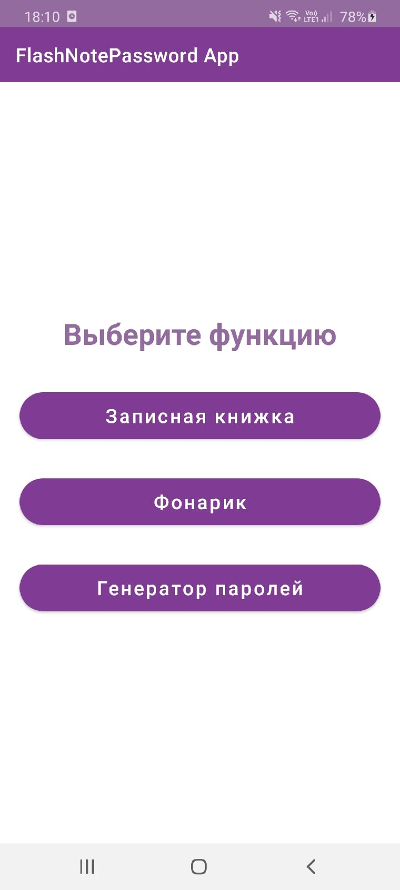

## Notes App

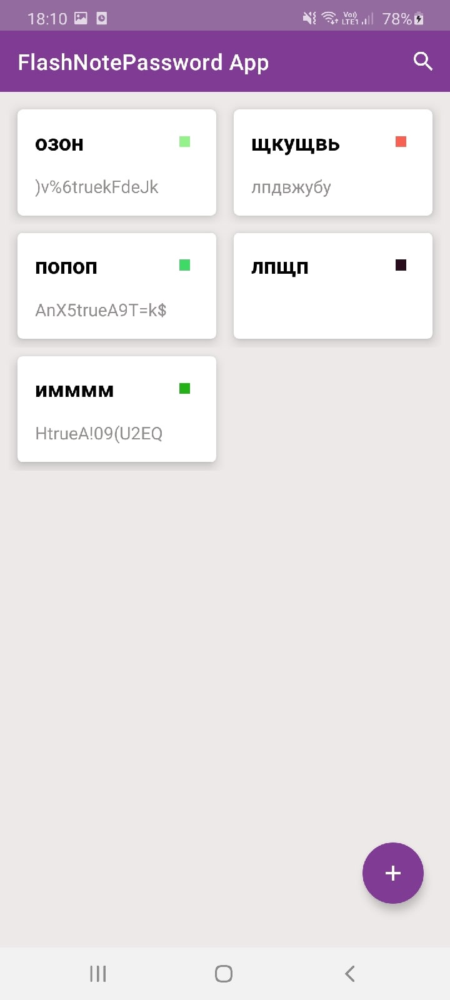
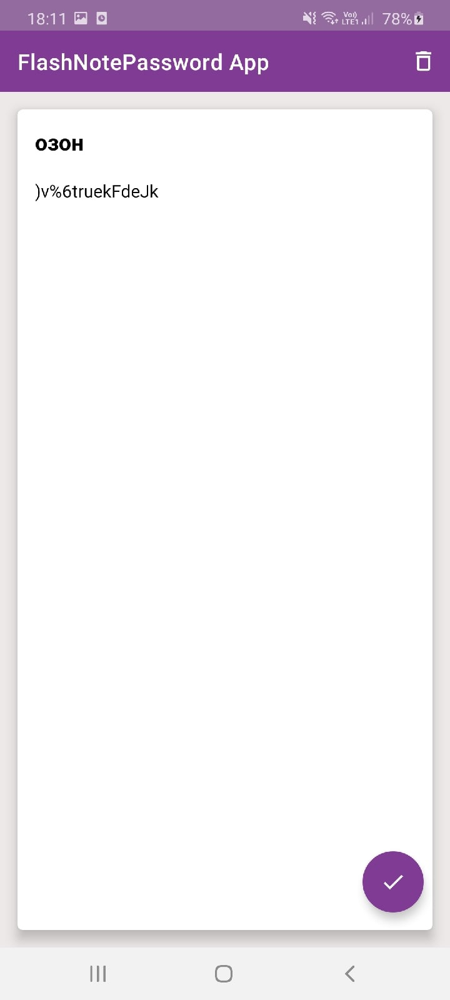
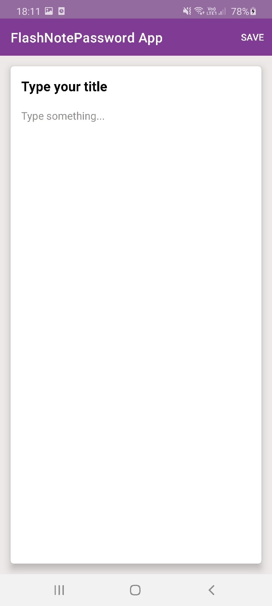
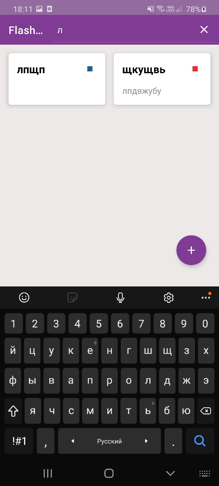
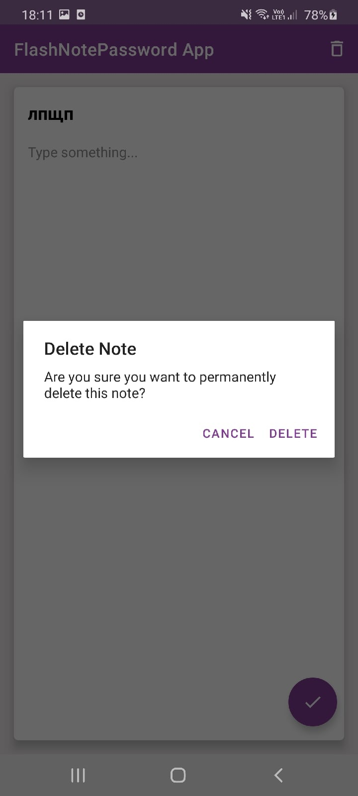

## Flashlight App
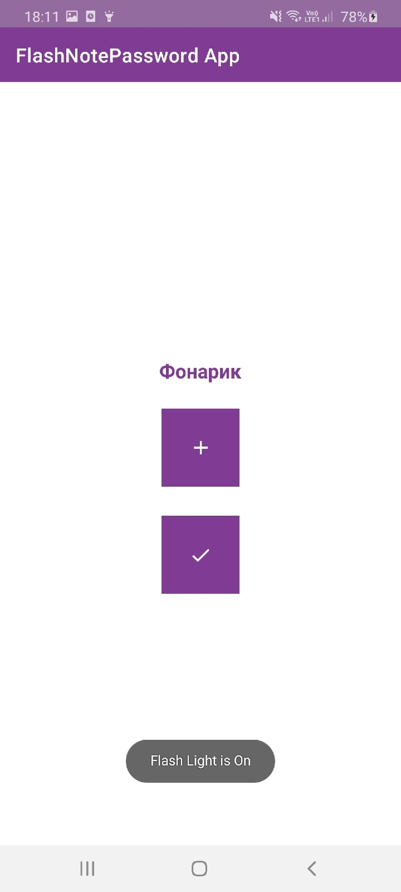
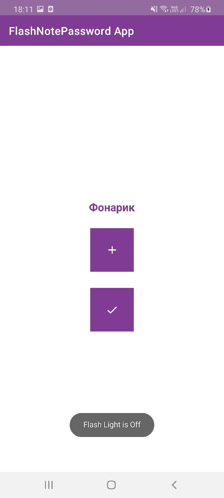

## Password Generator App
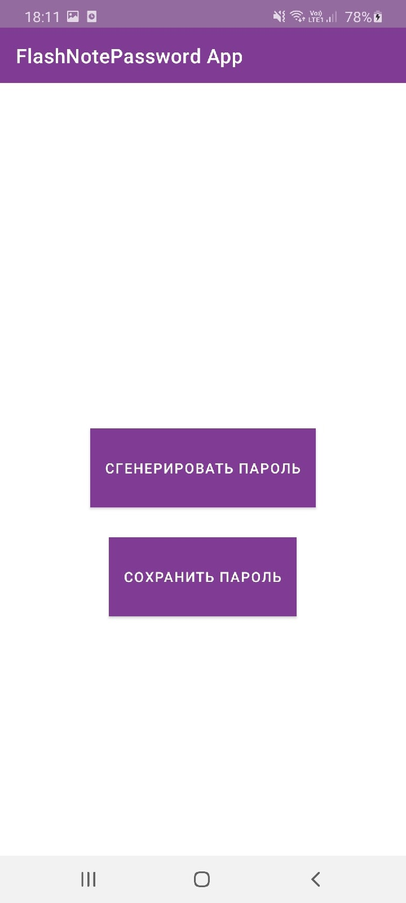
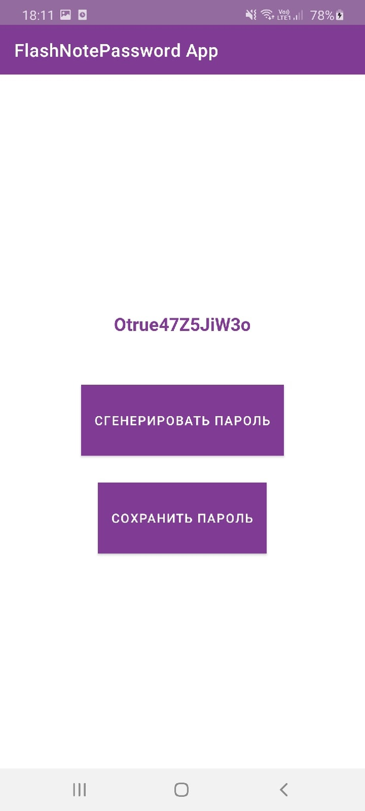
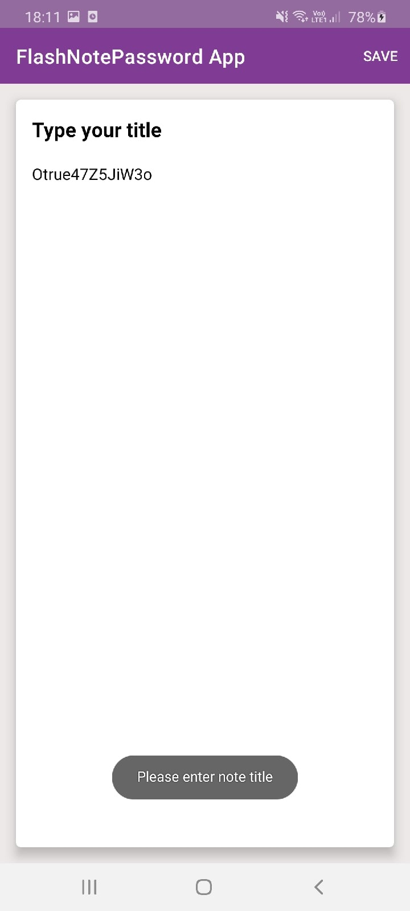
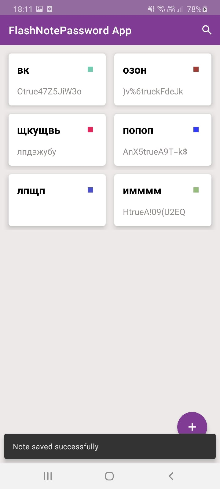
